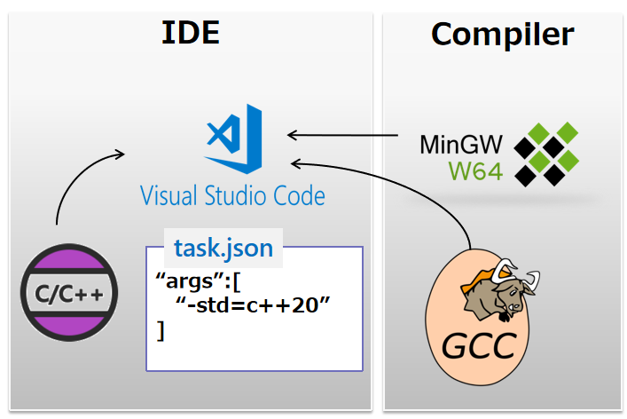

# C++ Cheat Sheets

| Title | Remark/code |
|-------|-------------|
| [Installation](https://cplusplus.com/doc/tutorial/introduction/) | Learn how to set up a C++ environment, including compilers like GCC, Clang, and IDEs like Visual Studio or Code::Blocks. |
| [Basic Syntax](https://cplusplus.com/doc/tutorial/program_structure/) | Understand the structure of a C++ program, including headers, main function, and basic I/O. |
| [Data Types](https://cplusplus.com/doc/tutorial/variables/) | Learn about C++ data types like int, float, char, string, and boolean. |
| [Control Structures](https://cplusplus.com/doc/tutorial/control/) | Explore decision-making (if-else, switch) and loops (for, while, do-while). |
| [Functions](https://cplusplus.com/doc/tutorial/functions/) | Write reusable code with functions, including function overloading and default arguments. |
| [Object-Oriented Programming (OOP)](https://cplusplus.com/doc/tutorial/classes/) | Understand classes, objects, constructors, destructors, and encapsulation. |
| [Inheritance](https://cplusplus.com/doc/tutorial/inheritance/) | Learn how to create derived classes and use single, multilevel, and multiple inheritance. |
| [Polymorphism](https://cplusplus.com/doc/tutorial/polymorphism/) | Understand function overriding, virtual functions, and dynamic binding. |
| [Pointers](https://cplusplus.com/doc/tutorial/pointers/) | Master pointers, memory allocation, and dereferencing in C++. |
| [Templates](https://cplusplus.com/doc/tutorial/templates/) | Learn about function and class templates for generic programming. |
| [STL (Standard Template Library)](https://cplusplus.com/reference/stl/) | Explore STL containers like vector, map, set, and algorithms like sort and search. |
| [File I/O](https://cplusplus.com/doc/tutorial/files/) | Learn how to handle file input/output using ifstream, ofstream, and fstream. |
| [Multithreading](https://cplusplus.com/reference/thread/thread/) | Implement concurrency with threads and synchronization mechanisms. |
| [Exception Handling](https://cplusplus.com/doc/tutorial/exceptions/) | Manage errors and exceptions using try, catch, and throw. |
| [Memory Management](https://cplusplus.com/doc/tutorial/dynamic/) | Understand dynamic memory allocation with new, delete, and smart pointers. |
| [Debugging](https://cplusplus.com/doc/tutorial/debugging/) | Learn debugging techniques and tools like GDB or Visual Studio debugger. |
| [Best Practices](https://github.com/isocpp/CppCoreGuidelines) | Follow modern C++ practices, guidelines, and coding standards. |

---

## Additional Resources

- 📖 [Official Documentation](https://en.cppreference.com/)  
- 🎥 [Video Tutorials](https://www.youtube.com/results?search_query=c%2B%2B+tutorials)  
- 📂 [Sample Projects](https://github.com/topics/cpp-project)  


# C++ Cheat Sheets List:

### home

| Title                                       | Remark         | 学習進捗状況 |
| ------------------------------------------- | -------------- | ------------ |
| [Introduction](#introduction)               | 開発環境設置等 | 済           |
| [Basic](#basic)                             |                | 済           |
| [Number](#number)                           |                | 済           |
| [Random Number](#random-number)             |                | 済           |
| [Characters And Text](#characters-and-text) |                | 計画中       |
| [Data operations](#data-operations)         |                | 計画中       |
| [Flow Control](#flow-control)               |                | 計画中       |
| [Loops](#loops)                             |                | 計画中       |
| [Arrays](#arrays)                           |                | 計画中       |
| [Loops](#loops)                             |                | 計画中       |
| [Pointers](#pointers)                       |                | 計画中       |
| [References](#references)                   |                | 計画中       |
| [Strings](#strings)                         |                | 計画中       |
| [One Definition Rule](#one-definition-rule) |                | 計画中       |
| [Functions](#functions)                     |                | 計画中       |
| [C++20 Concepts](#cpp20-concepts)           |                | 計画中       |
| [Classes](#classes)                         |                | 計画中       |
| [Inheritance](#inheritance)                 |                | 計画中       |
| [Polymorphism](#polymorphism)               |                | 計画中       |
| [Override](#override)                       |                | 計画中       |
| [Destructors](#destructors)                 |                | 計画中       |
| [Abstract Classes](#abstract-classes)       |                | 計画中       |

[Home](#home)

### Introduction

- C++ was updated 4 major times in 2011, 2014, 2017, and 2020 to C++11, C++14, C++17, C++20.

| Statically-typed | Dynamically-typed |
| ---------------- | ----------------- |
| C++              | Python            |
| C#               | JavaScript        |
| Java             | Ruby              |

- 開発環境設置

  - 
  - Setup the `args` of `tasks.json`
    ```json
      "args" :[
        "-g",
        "-std=c++20", // enable c++20 support
        "${workspaceFolder}\\*.cpp", // putting all the cpp in the workspaceFolder
        "-o",
        "{fileDirname}\\rooster.exe" // give the specific name for your exe file
      ]
    ```
  - The basic structure of the c++ console `int main(){}`

    ```c++
    #include <iostream>

    using namespace std; // using directive to pick up the std namespace to eliminate std:: in the code for example std::cout
    int main(){

       int input_number = 0;
       cin >> input_number; // reading data from the console
       cout << input_number; // output data to the console

       return 0;
    }
    ```

[Home](#home)

### Basic

- Errors and Warnings
- Statements and Functions
- Data input and output
- C++ Program Execution Model
- C++ core language Vs Standard library Vs STL
- Variables and data types Introduction

[Home](#home)

### Number

- Type of Number

| Type        | Bytes | Range                |
| ----------- | ----- | -------------------- |
| short       | 4     | -32,768 to 32,767    |
| int         | 4     | -2B to 2B            |
| long        | 4     | -2B to 2B            |
| long long   | 8     |                      |
| float       | 4     | -3.4E38 to 3.4E38    |
| double      | 8     | -1.7E308 to 1.7E308  |
| long double | 8     | -3.4E932 to 1.7E4832 |
| bool        | 1     | true/false           |
| char        | 1     |                      |

```c++
// the F is important, if without F by default the compiler will treat htis number as a double
// and then it will try to store a double inside a float variable and this can potentially
// cause data loss
float interestRate = 3.67F;

// Without L the compiler will treat this number as integer
long fileSize = 900000L;

// auto keyword it kind of makes our code shorter and more consistent
// auto keyword is very useful when working with more complex types
auto isValid = false;

auto interestRate = 3.67F; // this will give you float number
auto interestRate = 3.67; // this will give you integer

```

- brace initializer
  - modern way to initialize variable in c++

```c++
// by using brace initialization the compiler can detect
// the error and give you the red underline
int number{1.2};

// if you supply nothing the number variable will be initialized to zero
int number{};
cout << number; // will output 0
```

[Home](#home)

| System               | Digits  | Example  |
| -------------------- | ------- | -------- |
| Decimal(Base 10)     | 0-9     | 255      |
| Binary(Base 2)       | 0,1     | 11111111 |
| Hexadecimal(Base 16) | 0-9 A-F | FF       |

- Hexadecimal used to shorten binary number, are more compact, in programming we use it to represent colors
- using only six digits of a hexadecimal number we can represent any color
  RGB = Red(FF) Green(00) Blue(00) = FF 00 00

```c++
 int number = 0b11111111; // use 0b to print binary number
 int number = 0xFF; // use 0x to print Hexadecimal number
 cout << number; // output 255
```

- narrowing
  - initialize a variable of a smaller type using a larger type

```c++
int number = 1'000'000; // c++ let you make the number look better by letting you use the single quote to separate the digit
short another = number; // converting an integer to a short is a narrowing
cout << another; // output 1690 this is the result of narrowing convertion which is data loss
```

- you can use brace initializer to prevent the narrowing error `short another{number};`

[Home](#home)

### Random Number

```c++
#include <cstdlib>
#include <ctime> // library to use time() which return the current time in terms of number of seconds
                 // elapsed from January 1st 1970

using namespace std;
int main(){
   int number = rand(); // this will only generate the random number for one-time.

   time(0); // to call this function have to give it a special argumnet called null pointer or null ptr
   long elapsedSeconds = time(0); // Jan 1 1970
   srand(elapsedSeconds); // this is the formula for the rand();
   int number = rand();
   cout << number; // now everytime you reload you will get random number

}
```

- tutorial: rolling dice with the formula `[ rand() % ( maxValue - minValue + 1 )] + minValue`

```c++
#include <cstdlib>
#include <ctime>

using namespace std;
int main(){

   const short minValue = 1;
   cons short maxValue = 6;

   srand(time(0));
   short first = (rand()%(maxValue-minValue+1)) + minValue;
   short second = (rand()%(maxValue-minValue+1)) + minValue;

   cout << first << ", " << second;

   return 0;
}
```

[Home](#home)

### Characters And Text

- Auto
- Assignments

[Home](#home)

### Data operations

- Basic Operations
- Precedence and Associativity
- Prefix/Postfix Increment & Decrement
- Compound Assignment Operators
- Relational Operators
- Logical Operators
- Output formatting
- Numeric Limits
- Math Functions
- Weird Integral Types

[Home](#home)

### Flow Control

- If Statements
- Else If
- Switch
- Ternary Operators

[Home](#home)

### Loops

- For Loop
- While Loop
- Do While Loop

[Home](#home)

### Arrays

- Declaring and using arrays
- Size of an array
- Arrays of characters
- Array Bounds

[Home](#home)

### Pointers

- Declaring and using pointers
- Pointer to char
- Program Memory Map Revisited
- Dynamic Memory Allocation
- Dangling Pointers
- When new Fails
- Null Pointer Safety
- Memory Leaks
- Dynamically allocated arrays

[Home](#home)

### References

- Declaring and using references
- Comparing pointers and references
- References and const

[Home](#home)

### Strings

- Character Manipulation
- C-string manipulation
- C-String concatenation and copy
- Introducing std::string
- Declaring and using std::string

[Home](#home)

### One Definition Rule

- First Hand on C++ Functions
- Function Declaration and Function Definitions
- Multiple Files - Compilation Model Revisited
- Pass by value
- Pass by pointer
- Pass by reference

[Home](#home)

### Functions

- Introduction to getting things out of functions
- Input and output parameters
- Returning from functions by value
- Function Overloading Introduction
- Overloading with different parameters
- Intro to Lambda Functions
- Declaring and using lambda functions
- Capture lists
- Capture all in context
- Intro to function templates
- Trying out function templates
- Template type deduction and explicit arguments
- Template parameters by reference
- Template specialization

[Home](#home)

### Cpp20 Concepts

- Using C++20 Concepts
- Building your own C++20 Concepts
- Zooming in on the requires clause
- Combining C++20 Concepts
- C++20 Concepts and auto

[Home](#home)

### classes

- C++ Constructors
- Defaulted constructors
- Setters and Getters
- Class Across Multiple Files
- Arrow pointer call notation
- Destructors
- Order of Constructor Destructor Calls
- The this Pointer
- struct
- Size of objects

[Home](#home)

### Inheritance

- First try on Inheritance
- Protected members
- Base class access specifiers : Zooming in
- Closing in on Private Inheritance
- Resurrecting Members Back in Context
- Default Constructors with Inheritance
- Custom Constructors With Inheritance
- Copy Constructors with Inheritance
- Inheriting Base Constructors
- Inheritance and Destructors
- Reused Symbols in Inheritance

[Home](#home)

### Polymorphism

- Static Binding with Inheritance
- Dynamic binding with virtual functions
- Size of polymorphic objects and slicing
- Polymorphic objects stored in collections (array)

[Home](#home)

### Override

- Overloading, overriding and function hiding
- Inheritance and Polymorphism at different levels
- Inheritance and polymorphism with static members
- Final

[Home](#home)

### Destructors

- Virtual functions with default arguments
- Virtual Destructors
- Dynamic casts
- Polymorphic Functions and Destructors

[Home](#home)

### Abstract Classes

- Pure virtual functions and abstract classes
- Abstract Classes as Interfaces
